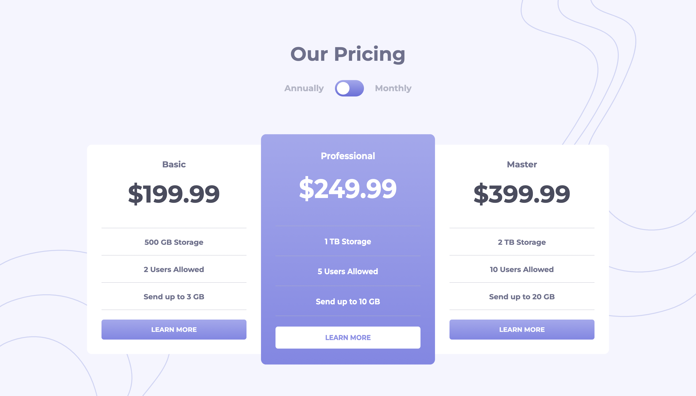

# Frontend Mentor - Pricing component with toggle solution

This is a solution to the [Pricing component with toggle challenge on Frontend Mentor](https://www.frontendmentor.io/challenges/pricing-component-with-toggle-8vPwRMIC). Frontend Mentor challenges help you improve your coding skills by building realistic projects.

## Table of contents

- [Overview](#overview)
  - [The challenge](#the-challenge)
  - [Screenshot](#screenshot)
  - [Links](#links)
  - [Built with](#built-with)
  - [Useful resources](#useful-resources)
- [Author](#author)

**Note: Delete this note and update the table of contents based on what sections you keep.**

## Overview

### The challenge

Users should be able to:

- View the optimal layout for the component depending on their device's screen size
- Control the toggle with both their mouse/trackpad and their keyboard

### Screenshot

### Links

- Solution URL: [https://github.com/Divjas-Singh/Pricing-component-toggle-master](https://github.com/Divjas-Singh/Pricing-component-toggle-master)
- Live Site URL: [https://divjas-singh.github.io/Pricing-component-toggle-master/](https://divjas-singh.github.io/Pricing-component-toggle-master/)

### Built with

- Semantic HTML5 markup
- CSS custom properties
- Flexbox
- CSS Grid
- Mobile-first workflow
- [Styled Components](https://fonts.google.com/) - For styles

### Useful resources

- [resource 1](https://www.w3schools.com/)
- [resource 2](https://developer.mozilla.org/en-US/docs/Web/CSS)

## Author

- Frontend Mentor - [@Divjas-Singh](https://www.frontendmentor.io/profile/Divjas-Singh)
